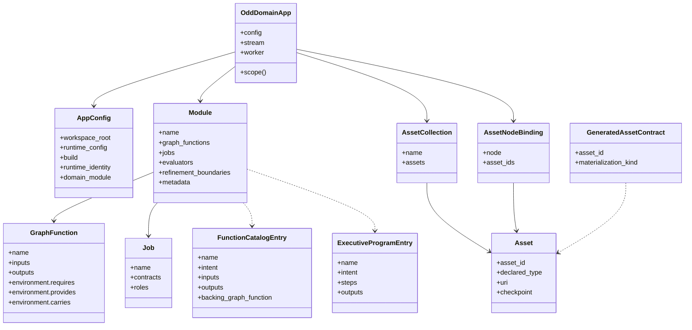
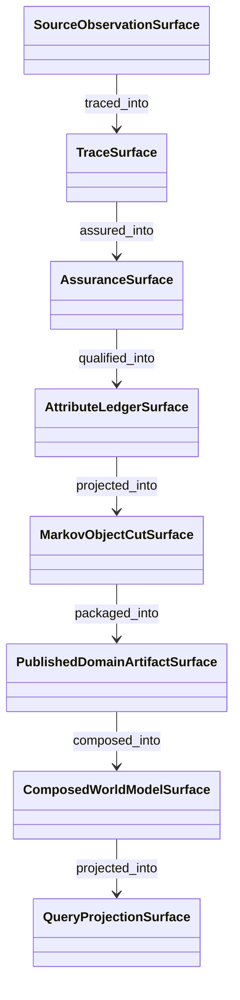
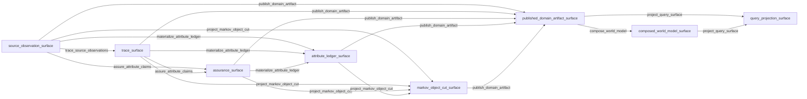
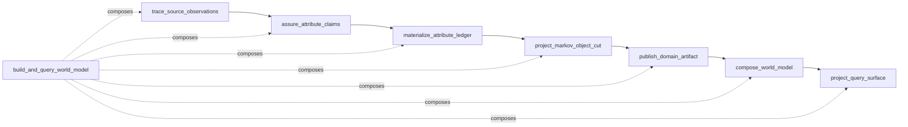
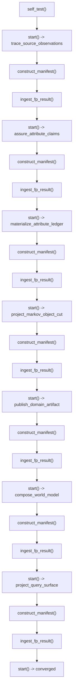

# STRATEGY: odd_domain Current Architecture And Graphs

**Author**: codex
**Date**: 2026-04-15T18:03:54Z
**Addresses**: `build_tenants/python/code/odd_domain/gtl_module.py`, `build_tenants/python/code/odd_domain/app.py`, `build_tenants/python/code/odd_domain/workspace_assets.py`, `build_tenants/python/code/odd_domain/constructor.py`, `build_tenants/python/code/odd_domain/self_test.py`, `build_tenants/common/design/ODD_GTL_ATTRIBUTE_LEDGER_CARRIER.md`
**Status**: Draft

## Summary

This post describes the current `odd_domain` runtime architecture as it exists
after the first GTL carrier wave.

It is a current-reality read, not a target-only proposal.

The short version is:

- `odd_domain` now has one active GTL executive carrier:
  `build_and_query_world_model`
- that carrier is published through one GTL module and one live runtime job
- the runtime progresses lawfully through:
  `start -> fp_manifest_path -> construct_manifest() -> ingest_fp_result() -> next edge`
- the semantic chain is now executable from:
  `source_observation_surface`
  through
  `trace -> assurance -> attribute_ledger -> markov_object_cut -> published_domain_artifact -> composed_world_model -> query_projection`
- the constructor is now narrowed by target surface, so early edges do not
  force later composition/query outputs

## Analysis

### 1. Architectural Reading

The current architecture has five main layers:

1. `App Runtime`
   `odd_domain.app` bootstraps the ABG event stream and constructs `Scope`.
2. `Published GTL Module`
   `odd_domain.gtl_module` publishes nodes, graph functions, refinement
   boundaries, evaluators, and one active job.
3. `Workspace Asset Inventory`
   `odd_domain.workspace_assets` binds concrete workspace files and directories
   to the published node names.
4. `Constructor`
   `odd_domain.constructor` is the retained F_P closure path that materializes
   the target asset for the currently selected edge.
5. `Proof Surface`
   `odd_domain.self_test` proves the executive carrier end to end by replaying
   the runtime loop over a clean workspace.

### 2. Runtime Domain Model

This is the current runtime/domain-model shape of the carrier, not the business
world-model semantics:

### 3. Semantic Surface Model

This is the actual retained semantic surface chain currently published by the
GTL carrier:

That diagram is dependency/projection order, not OO inheritance.
The current chain is:

- source observation is the retained evidence entry
- trace records point back to source observation
- assurance records accept traced claims
- attribute ledger entries are qualified claims over the assured state
- Markov object cuts project immutable object state from the ledger
- published domain artifacts package those cuts
- composed world models stitch published artifacts
- query projection is a downstream serving surface over published/composed state

### 4. Graph Functions Actually Published

The current leaf graph functions in
[gtl_module.py](/Users/jim/src/apps/odd_domain/build_tenants/python/code/odd_domain/gtl_module.py:1)
are:

- `trace_source_observations`
- `assure_attribute_claims`
- `materialize_attribute_ledger`
- `project_markov_object_cut`
- `publish_domain_artifact`
- `compose_world_model`
- `project_query_surface`

The active executive graph function is:

- `build_and_query_world_model`

There is only one active runtime job:

- `build_and_query_world_model_job`

That matters because the earlier duplicate-runtime condition came from two
overlapping executive jobs exposing the same inner vectors as competing entry
points. That is now gone.

### 5. Graph Function Flow

This is the current actual graph-function chain:

### 6. Executive Carrier Flow

The one active executive carrier is just the ordered composition of those leaf
functions:

### 7. Evaluator Shape

Each retained leaf edge currently has:

- one deterministic `F_D` evaluator checking the target surface contract
- one probabilistic `F_P` evaluator:
  `odd_domain_fp_semantic_constructor`

So the current runtime law is:

- `F_D` proves the target surface is materially present in the workspace
- `F_P` is satisfied by the retained constructor path and then closed through
  result ingestion

### 8. Concrete Asset Bindings

The current node bindings come from
[workspace_assets.py](/Users/jim/src/apps/odd_domain/build_tenants/python/code/odd_domain/workspace_assets.py:1).

Important current-reality point:

`odd_domain` is still proving itself against retained example artifacts under
`build_tenants/common/examples/...`, not yet against arbitrary user-defined
domain projects.

That means the current carrier is a real GTL runtime, but its concrete asset
inventory is still intentionally bounded to the proving corpus:

- FpML observation surface
- trade/APRA trace and assurance surfaces
- trade attribute ledger
- trade Markov object cut
- trade published fragment
- composed published sandbox root
- query summary projection

### 9. Constructor Dispatch Model

The constructor in
[constructor.py](/Users/jim/src/apps/odd_domain/build_tenants/python/code/odd_domain/constructor.py:1)
is now narrowed by target surface.

This is the current dispatch shape:

```mermaid
flowchart TD
  M["fp_manifest target_asset"] --> D["construct_manifest()"]

  D --> S1["source_observation_surface
  -> fpml_trade_domain.materialize_source_observation_surface(reset=True)"]

  D --> S2["trace_surface
  -> trade_to_apra.materialize_trace_surface(reset=True)"]
  D --> S3["assurance_surface
  -> trade_to_apra.materialize_assurance_surface(reset=True)"]
  D --> S4["attribute_ledger_surface
  -> trade_to_apra.materialize_attribute_ledger_surface(reset=True)"]
  D --> S5["markov_object_cut_surface
  -> trade_to_apra.materialize_markov_object_cut_surface(reset=True)"]
  D --> S6["published_domain_artifact_surface
  -> trade_to_apra.materialize_published_domain_artifact_surface(reset=True)"]
  D --> S7["composed_world_model_surface
  -> trade_to_apra.materialize_composed_world_model_surface(reset=True)"]
  D --> S8["query_projection_surface
  -> query.trade_to_apra.build()"]
```

The main architectural effect of the `T-016` refactor is:

- early edges no longer force APRA composition or stitching outputs
- later edges still widen into composed-world-model and query outputs

### 10. Runtime Closure Loop

This is the current closure path:

```mermaid
flowchart LR
  A["odd_domain.start()"] --> B["gen_start(scope, stream)"]
  B --> C["selected edge + fp_manifest_path"]
  C --> D["odd_domain.construct_manifest(manifest)"]
  D --> E["target surface materialized"]
  E --> F["result JSON written"]
  F --> G["ingest_fp_result(result_path, workspace)"]
  G --> H["assessed / proof_passed / closure_passed events"]
  H --> I["next odd_domain.start()"]
  I -->|until delta = 0| J["converged"]
```

This is no longer only theoretical. The product-local self-test in
[self_test.py](/Users/jim/src/apps/odd_domain/build_tenants/python/code/odd_domain/self_test.py:1)
executes that loop over a clean workspace and converges all seven retained
edges.

### 11. Product-Local Program Proof

The active program proof is:

### 12. Current Boundedness

The current architecture is real, but still intentionally bounded:

- the constructor still uses retained canonical build-line materializers
- those materializers are stage-specific now, but not yet fine-grained
  incremental update engines
- the concrete asset inventory is still tied to the proving corpus examples
- the runtime is proving `odd_domain` over one retained trade/APRA steel thread,
  not yet over arbitrary project-specific domain inventories

That means the architecture is now best read as:

- genuine GTL runtime carrier
- genuine runtime proof
- bounded retained domain corpus
- still room for later generalization of asset binding and constructive
  granularity

## Recommended Action

1. Review this post as the current-reality explanation of the `odd_domain`
   carrier.
2. If the diagrams match your mental model, keep using this as the commentary
   explanation layer rather than trying to infer architecture from scattered
   code.
3. If you want the next wave, the most natural move is one of:
   - generalize asset binding away from retained example-only paths
   - make constructor materialization more incremental within each retained
     stage
   - introduce the next proving corpus beyond trade/APRA while keeping the same
     carrier law
