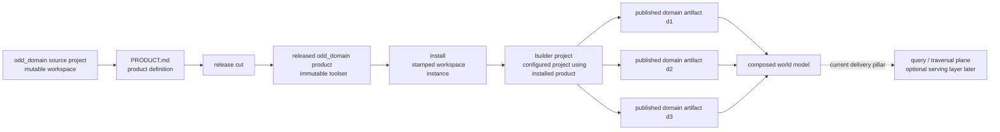
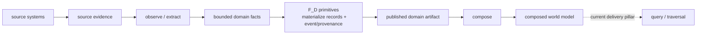
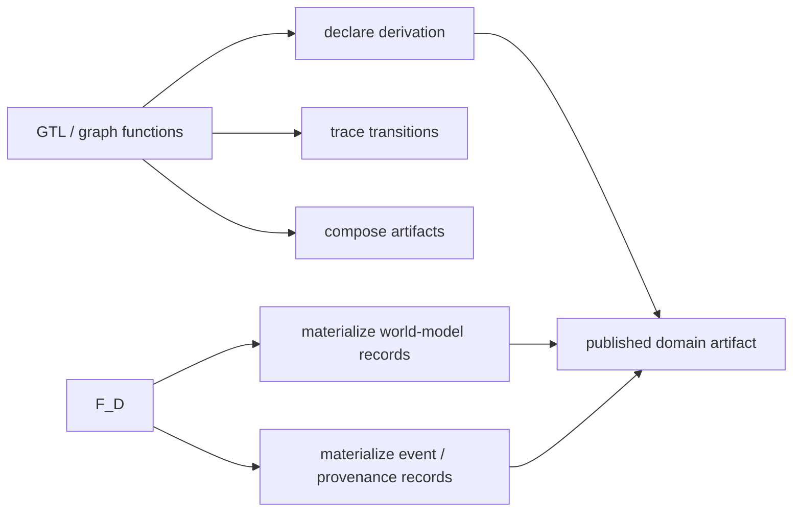

# STRATEGY: odd_domain Build And Composition Graph

**Author**: codex
**Date**: 2026-04-15T20:51:45Z
**Addresses**: `specification/INTENT.md`, `specification/PRODUCT.md`, `.genesis/docs/standards/WORLD_MODEL_METHOD.md`
**Status**: Draft

## Summary

This post captures the current graph shape for `odd_domain` before ratification
into specification or method.

It describes both:

- current reality, as repriced in `INTENT.md` and `PRODUCT.md`
- target direction, for how the build/composition/query line should be
  understood operationally

The current reading is:

1. `odd_domain` builds published domain artifacts
2. `odd_domain` composes those artifacts into higher-order world models
3. query/traversal remains a current delivery pillar, but not a constitutional
   core intent

## Analysis

### Current Governing Read

The current product surfaces read as:

- two constitutional intents in
  [PRODUCT.md](/Users/jim/src/apps/odd_domain/specification/PRODUCT.md:1)
  and [INTENT.md](/Users/jim/src/apps/odd_domain/specification/INTENT.md:1):
  - build published domain artifacts
  - compose those artifacts into higher-order world models
- one additional active delivery pillar:
  - query/traversal over those artifacts and composed world models

The method surface in
[WORLD_MODEL_METHOD.md](/Users/jim/src/apps/odd_domain/.genesis/docs/standards/WORLD_MODEL_METHOD.md:1)
now matches that split:

- constitutional intents: build + compose
- query/serving/traversal: optional downstream query plane concern

### Lifecycle Graph

### Build Graph

### Responsibility Split

### Reading

The important structural split is:

- source projects build the next released `odd_domain` product
- installed released products are consumed by builder projects
- builder projects publish immutable domain artifacts
- composed world models are built by referencing published artifacts, not by
  flattening mutable builder state
- query/traversal is important today, but can move behind a dedicated query
  plane later without changing the constitutional identity of the line

### Why This Matters

This graph preserves the distinctions that have repeatedly drifted together:

- released product vs install
- install vs builder project
- mutable builder state vs published domain artifact
- constitutional product identity vs current delivery pillar
- semantic derivation via graph functions vs record materialization via `F_D`

If these boundaries blur, the line tends to collapse into:

- mutable toolsets inside consuming projects
- bespoke loader sprawl
- weak provenance at the attribute level
- composition over ambient state instead of over versioned artifacts

## Recommended Action

1. Review whether this graph is the right ratified reading for `odd_domain`.
2. If yes, lift the graph shape into `PRODUCT.md` and, where appropriate,
   `WORLD_MODEL_METHOD.md`.
3. Use this graph as the basis for downstream build tickets covering:
   - requirement repricing
   - build-line design
   - GTL/F_D split
   - provenance/event emission
   - composition and optional query-plane realization
