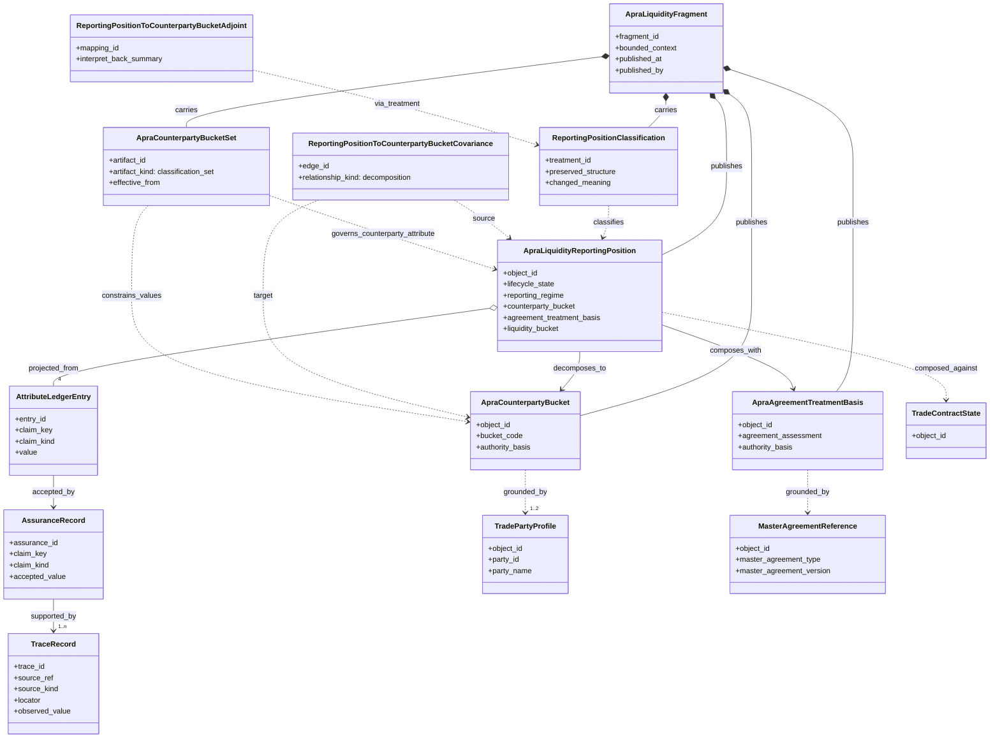

# SCHEMA: APRA Liquidity Domain Model

**Author**: codex
**Date**: 2026-04-16T01:44:46Z
**Addresses**: `build_tenants/common/examples/sandbox_trade_to_apra_mvp/published/apra_liquidity_domain/fragment.json`, `build_tenants/common/examples/sandbox_trade_to_apra_mvp/published/apra_liquidity_domain/objects/reporting_position.json`, `build_tenants/common/examples/sandbox_trade_to_apra_mvp/published/apra_liquidity_domain/objects/counterparty_bucket.json`, `build_tenants/common/examples/sandbox_trade_to_apra_mvp/published/apra_liquidity_domain/objects/agreement_treatment_basis.json`, `build_tenants/common/examples/sandbox_trade_to_apra_mvp/published/apra_liquidity_domain/treatments/reporting_position_classification.json`, `build_tenants/common/examples/sandbox_trade_to_apra_mvp/published/apra_liquidity_domain/reference_artifacts/apra_counterparty_bucket_reference_set_v1.json`, `build_tenants/python/code/odd_domain/build_line/trade_to_apra.py`
**Status**: Draft

## Summary

This post describes the current APRA-liquidity domain model as published by the
retained `odd_domain` trade-to-APRA corpus.

It is a current-reality read, not a target-only proposal.

The short version is:

- the APRA fragment currently has one governing `MarkovObject`:
  `ApraLiquidityReportingPosition`
- that reporting position is decomposed into two principal local semantic
  components:
  `ApraCounterpartyBucket` and `ApraAgreementTreatmentBasis`
- the reporting position is projected from four ledger-backed claims:
  `counterparty_bucket`, `agreement_treatment_basis`, `liquidity_bucket`,
  `reporting_lifecycle_state`
- the counterparty-bucket claim is now grounded in both:
  official APRA authority claims and imported trade counterparty evidence
- the agreement-treatment and liquidity-bucket claims are composed claims:
  official APRA guidance plus imported trade agreement/product evidence

## Analysis

### 1. Current Reading

The published APRA fragment at
[fragment.json](/Users/jim/src/apps/odd_domain/build_tenants/common/examples/sandbox_trade_to_apra_mvp/published/apra_liquidity_domain/fragment.json:1)
contains:

- 1 markov object:
  `ApraLiquidityReportingPosition`
- 2 world-model objects:
  `ApraCounterpartyBucket`
  and
  `ApraAgreementTreatmentBasis`
- 1 treatment surface:
  `odd_domain.treatment.apra_liquidity.reporting_position.classification.v1`
- 1 local covariance edge:
  reporting position -> counterparty bucket
- 1 local adjoint mapping:
  counterparty bucket can be interpreted back as one governed component of the
  reporting position
- 1 temporal reference artifact:
  the APRA counterparty-bucket classification set

That gives a clean local APRA domain core:

1. one reporting position as the governing object cut
2. one classification object for counterparty bucket
3. one contractual-treatment object for agreement basis
4. one reference set that constrains allowed bucket values

### 2. Mermaid UML

### 3. Domain Interpretation

The important thing about the current shape is that the APRA domain is not
modelled as a flat reporting row.

It is modelled as:

- a governing reporting-position object cut
- projected from ledger-backed claims
- with one decomposed classification object
- with one composed contractual-treatment object
- constrained by a governed reference artifact

That makes the APRA side legible as a world model rather than a static target
table.

### 4. Claim-Level Reading

The reporting-position object cut at
[reporting_position.json](/Users/jim/src/apps/odd_domain/build_tenants/common/examples/sandbox_trade_to_apra_mvp/published/apra_liquidity_domain/objects/reporting_position.json:1)
is currently projected from four ledger entries:

1. `counterparty_bucket`
   classified from APRA authority claims plus imported trade counterparty
   evidence
2. `agreement_treatment_basis`
   composed from APRA contractual-treatment guidance plus imported
   master-agreement evidence
3. `liquidity_bucket`
   composed from APRA outflow guidance plus imported derivative-product
   evidence
4. `reporting_lifecycle_state`
   projected from current retained build state

That means the APRA domain is already doing the right semantic split:

- classification claim
- contractual-treatment claim
- liquidity-treatment claim
- project-state claim

### 5. External Boundaries

The APRA domain is still intentionally narrow.

Its external semantic dependencies are explicit:

- trade contract state
- trade party profiles
- master agreement reference
- imported trade observation
- official APRA authority claims extracted from:
  APS 210 / APG 210 / ARS 210.0 / APRA FAQ source set

So the APRA domain is now real in the bounded sense:

- document-backed
- trade-composed
- ledger-projected
- queryable via published explainability path

It is not yet the full APRA regulatory universe.

## Recommended Action

Keep this as the current review model for the APRA slice.

If adopted into ratified design later, the next deepening moves should be:

1. add a second APRA reporting-position example so the model proves it is a
   domain shape rather than a single-instance reading
2. deepen the agreement-treatment object into a richer contractual-treatment
   family if APRA/liquidity interpretation starts to branch materially
3. replace more of the hand-bounded `authority_claims.json` surface with a
   deeper direct document-extraction lane over the official APRA sources
