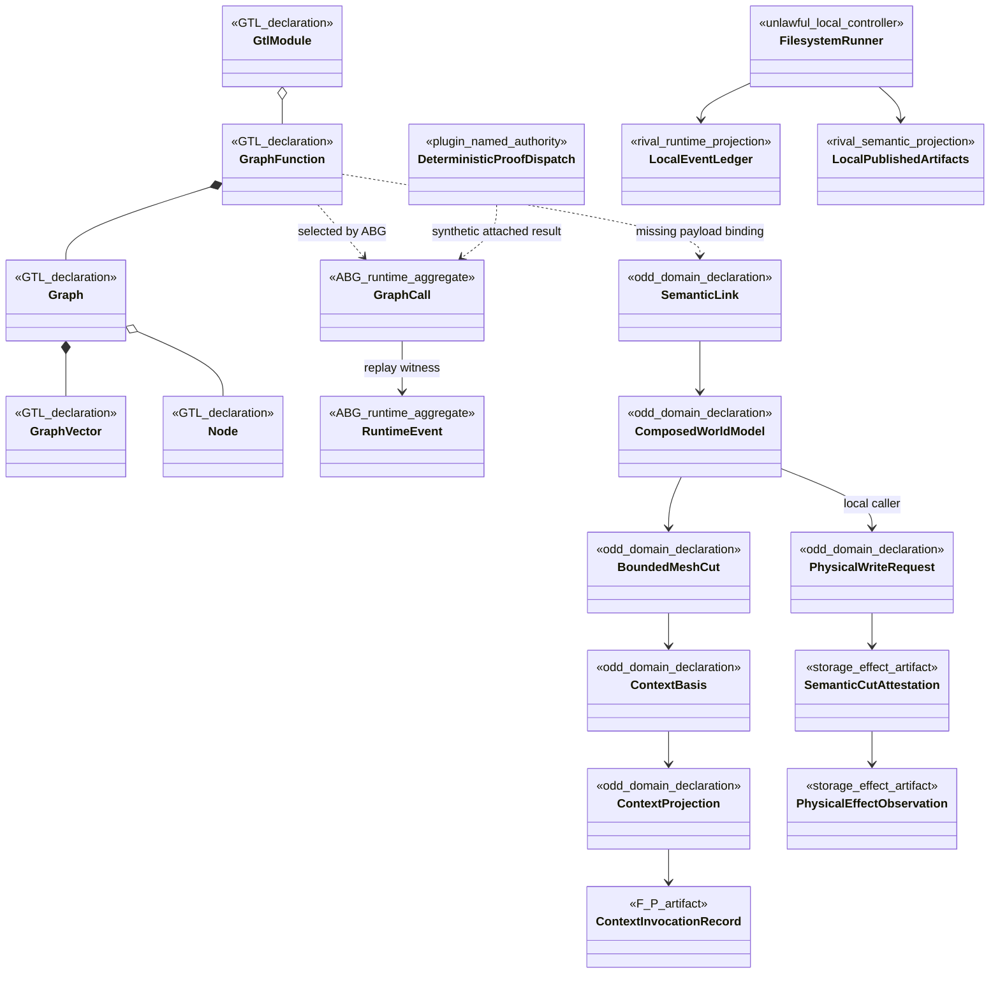
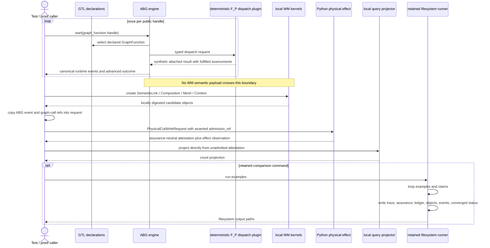

# REVIEW: odd_world_model Product Ratification And Design-Axiom Backfill

**Type:** Full product review commentary
**Reviewer:** Codex
**Date:** 2026-07-12
**Scope:** Live specification, accepted/current design, TypeScript and Python
realization, active tickets, tests, and persisted development proof
**Reference gate:**
`/Users/jim/src/apps/abiogenesis/.ai-workspace/comments/claude/20260713T020000Z_REVIEW_GATE_design_diagram_axiom_evaluation_criteria.md`
**Ruling:** Do not ratify the product realization or close T-023, T-026, T-028,
or T-029. Preserve the useful component work and re-enter at design.

## Executive Verdict

The Intent and Product direction are load-bearing. No intent or product reprice
is required by this review.

The realization is not yet an integrated world-model product. It contains three
different paths:

1. a real GTL declaration and ABG traversal probe with generic substrate payloads;
2. a separate set of useful WM semantic kernels and a robust physical effect;
3. a retained imperative filesystem runner that still behaves as a public
   constructor and mints its own events, closure status, ledgers, and published
   outputs.

The current "full steel thread" copies graph-call and event references from path
1 into objects built by path 2. It does not carry WM semantic payloads through
the selected GraphFunctions, ABG admission, WM semantic acceptance, and
publication. This is component integration by identifier attachment, not the
product chain required by the specification.

The ABIogenesis 5.0 lesson applies directly in one respect: conformance of a
named graph structure must not be mistaken for execution of the product's
semantic program. It does not require discarding the current work. The graph
declarations, exact-ref kernels, storage adapter, and substrate isolation are
reusable. The correction is to close one vertical semantic path before adding
more horizontal surface.

## Verified Gates

- TypeScript tests: 33/33 pass.
- TypeScript strict compilation: pass.
- Python storage tests: 21/21 pass.
- `git diff --check`: pass.
- Persisted proof hashes: 9/9 match the manifest.
- Persisted ABG event counts: 267 first-run and 267 repeat-run events.
- Source state: dirty, 130 paths, correctly disclosed by the manifest.
- Release authority: correctly not claimed.

These results qualify components. They do not resolve the product findings
below.

## Findings

### P0-1: The required design diagrams were absent before implementation

The review gate requires a domain model, sequence diagram, and state machine on
the current design leaf before code. A repository census finds only one
`classDiagram`, in the explicitly superseded
`build_tenants/typescript/design/40-module-boundaries.md`. The accepted common
architecture, ADR-WM-004, current full-build design, and storage design contain
none of the required three-diagram set.

This is a ratification blocker by the supplied gate. The as-built reconstruction
below exposes defects that prose allowed to remain ambiguous. It is review
evidence, not a substitute for corrected target diagrams in design.

### P0-2: The full steel thread does not execute the WM semantic chain through GTL/ABG

`full_steel_thread.test.ts:58-74` starts seven handle-only substrate probes.
`full_steel_thread.test.ts:76-190` then constructs the source ref, interpreted
ref, semantic link, composition, mesh cut, context basis, projection, and
invocation directly through local constructors. `full_steel_thread.test.ts:192-240`
copies graph-call and event IDs from the unrelated probes into a direct physical
write request. `full_steel_thread.test.ts:242-288` calls the Python store and
query projector directly.

The current design admits the missing payload binding at
`80-current-full-build-design.md:64-67`, but T-026 calls the path end-to-end at
`T-026-rebuild-world-model-in-typescript-tenant.md:120-127` and the common
architecture requires source admission, GraphFunction-carried publication,
attestation admission, model-output lineage, and staleness in
`WORLD_MODEL_COMMON_ARCHITECTURE.md:316-329`.

Consequences:

- no retained source observation is admitted through the selected function;
- no F_P semantic proposal is checked and admitted as the semantic payload;
- no attributed WM authority accepts a claim;
- no published semantic cut is produced by ABG-carried constructive history;
- no attestation is admitted before query consumption; and
- no source change makes the integrated invocation basis stale.

This fails REQ-BUILD-CONSTRAINT-001, REQ-BUILD-VERIFY-003/009, and the first
integrated-slice contract. The current proof is valid only as combined component
and substrate-shape evidence.

### P0-3: The retained filesystem runner remains a rival public constructive path

The package publishes `odd-world-model-ts` and an `examples` script at
`package.json:5-12`. The CLI invokes `runExamples` at `cli/main.ts:18-39`.
`run_examples.ts:156-195` writes local manifests, result assessments, an event
ledger, and `active-workflow.json` with `status: converged`.
`run_examples.ts:198-225` owns traversal loops and invokes builders that write
trace, assurance, attribute-ledger, object-cut, publication, composition, and
query files directly.

ADR-006 classifies this as historical comparison evidence and prohibits citing
it as GTL/ABG closure proof at `ADR-006-exact-rc3-proving-substrate-and-migration-seam.md:71-75`.
The proof generator nevertheless cites `example_runner.test.ts` for every
WORLD-OBJECT and BUILD-CAP requirement at
`generate_full_build_proof.ts:73-81`.

Labeling the runner historical does not contain its authority while it remains
an exported binary, writes current-shaped `published/` and runtime surfaces, and
is cited by the requirement ledger. This violates the one-truth, ABG ownership,
and public GraphFunction invocation laws.

### P0-4: Admission, acceptance, and publication are caller assertions, not replay-derived states

There is no current `PublishedSemanticCut`, semantic admission result, WM
acceptance decision, or publication-state carrier in the TypeScript semantic
modules. `ContextInvocationRecord.admission_ref` is optional at
`semantic_memory.ts:93-108`; its constructor accepts any non-empty string at
`context_memory.ts:128-136`; and the unit test explicitly proves an invocation
without admission at `semantic_memory.test.ts:247-283`.

The physical request similarly accepts caller-supplied `admission_ref` and
`admitted_at` values at `physical_cut_store.ts:34-45`. The query projector checks
only attestation structure and digests at `query_projection.ts:37-82`; it does
not require an ABG admission or WM publication witness.

The common design requires storage to persist already-admitted payloads and
query to project admitted truth at
`WORLD_MODEL_COMMON_ARCHITECTURE.md:118-122`. It requires ABG admission before
publication at `WORLD_MODEL_COMMON_ARCHITECTURE.md:192-214`.

The missing state aggregate is the central product defect. Strings that look
like admission references cannot substitute for admitted events and replay
projections.

### P1-1: Current GTL assets are nominally typed by missing or retained contracts

The GTL assets publish many `contract://odd_world_model/...` schema refs for
which no contract artifact exists. Examples are at `gtl/assets.ts:105-123` and
`gtl/assets.ts:149-242`. Conformance locally wraps those refs in generic target
carrier envelopes; it does not validate the absent WM payload contracts.

The current `ProjectedDomainCut` node points to the retained
`markov_object.schema.json` and `AdmittedDomainClaims` points to the retained
attribute-ledger schema at `gtl/assets.ts:124-145`. The schema registry itself
classifies those shapes as retained compatibility inputs, not forward authority,
at `build_tenants/common/schemas/README.md:29-40`.

The retained Markov schema cannot express identity direction, projection
support, null-peer basis, held-out treatment verification, publication
classification, or candidate/established status. A GraphFunction cannot be a
reviewable typed contract when its payload schema is missing or constitutionally
insufficient.

### P1-2: Mesh and context carriers validate supplied selections but do not realize their product contracts

`createBoundedMeshCut` validates a caller-supplied node/link set at
`semantic_mesh.ts:39-59`. The carrier has no root refs, relation selectors, or
closure declaration, despite REQ-MESH-CAP-009. It cannot prove that nodes are
published cuts. `SemanticLink.relation_type` is an open string and its temporal
coordinates may be empty; provenance, relation-role vocabulary, validity, and
supersession status are not closed by `semantic_link.schema.json:7-80`.

`ContextBasis` lacks the required temporal coordinates, source/semantic
authority, freshness, fidelity, loss, exclusions, truncation, and unresolved
gaps (`context_basis.schema.json:7-65`; compare
`25-governed-context-memory-capability.md:18-28`). `ContextProjection` carries a
content digest but no content or resolvable content ref, and no renderer exists
behind the declared renderer handle. The integrated test supplies a digest of a
locally invented object rather than rendering model context.

These kernels are useful exactness checks. They are not yet `resolve_mesh_cut`
or `project_context` product implementations.

### P1-3: The F_P probe self-authors fulfillment and proves transport, not semantic interpretation

`public_start.ts:36-65` is a dispatch plugin that creates
`fulfillment_status: fulfilled` assessments and synthetic proof refs. The probe
has no WM semantic input or output payload. The test proves the C-call sequence
and ABG events, which is useful substrate evidence, but cannot prove F_D checks
over a semantic proposal, WM acceptance, or context interpretation.

Under the supplied sequence criteria, a dispatch plugin cannot own a closure
classification. Retain this as a named deterministic transport smoke test, but
do not count it as product F_P, admission, or closure proof.

### P1-4: The requirement ledger is a routing index, not requirement evidence

`generate_full_build_proof.ts:48-129` assigns statuses and evidence by matching
substrings in requirement IDs. It does not evaluate requirement predicates.
The persisted ledger correctly says `closure_authority: not_claimed`, and every
row remains pending review. The manifest's 116-row counts therefore say how the
generator grouped requirements, not which requirements passed.

The ledger is useful as an inventory. T-026 and the design status must not call
the product complete until each live first-slice requirement has a specific
witness or an explicit deferment consistent with the current goal.

### P1-5: Accepted design contradicts the repaired assurance boundary

The common carrier table says `SemanticCutAttestation` binds an admitted cut and
proof state at `WORLD_MODEL_COMMON_ARCHITECTURE.md:124-138`. The same design later
defines it as assurance-neutral and only offered to ABG after physical
observation at `WORLD_MODEL_COMMON_ARCHITECTURE.md:192-210`.
`GTL_GRAPH_FUNCTION_CONTRACTS.md:94-99` still requires a "verified"
attestation. The repaired code correctly contains no provider-authored
verification or semantic admission state.

The code repair should stand. The stale design claims must be corrected before
the function contracts are ratified.

### P1-6: The successor migration seam lacks an equivalence contract

ADR-006 correctly isolates rc.3 imports and exact dependency identities. That is
worth preserving. It does not yet define which WM contracts are stable, which
are provisional, or how a GTL/ABG 5.0 successor proves semantic-payload,
admission, event, replay, and closure equivalence.

Because the current target carrier does not contain WM payloads, "adapter-only
migration" is still a hypothesis. The migration gate must name exact invariants
and allow an explicit design reprice when the successor contract differs. This
is the containment needed to keep the intentional prototype from becoming a
rewrite commitment.

## As-Built Domain Model

Stereotypes use underscores because Mermaid stereotype tokens cannot contain
spaces.



## As-Built Sequence



## As-Built State Machine

```mermaid
stateDiagram-v2
  state "ABG probe" as ABG {
    [*] --> RegistryAdmitted: registry_entry_admitted
    RegistryAdmitted --> FunctionSelected: graph_function_selected
    FunctionSelected --> GraphCallOpen: graph_call_opened
    GraphCallOpen --> Traversed: vector_traversal_planned
    Traversed --> VectorClosed: vector_closed
    VectorClosed --> [*]
  }

  state "Local semantic path" as Local {
    [*] --> LocallyConstructed: local constructors
    LocallyConstructed --> AdmissionRefAsserted: caller string
    AdmissionRefAsserted --> PhysicallyWritten: Python effect
    PhysicallyWritten --> PhysicallyObserved: PyIceberg and DuckDB observation
    PhysicallyObserved --> DirectlyQueried: local query projector
    DirectlyQueried --> [*]
  }

  state "Required but absent" as Missing {
    Proposed
    DeterministicallyChecked
    ABGAdmitted
    WMAccepted
    Published
    Superseded
    Stale
  }

  state "Retained filesystem path" as Legacy {
    [*] --> LocalLoop: runExamples
    LocalLoop --> LocalTruthWritten: builder code
    LocalTruthWritten --> LocallyConverged: active-workflow status flag
    LocallyConverged --> [*]
  }

  note right of VectorClosed: Runtime refs are copied into local objects; no semantic state transition exists
```



## D/S/M/X Evaluation

| Check | Result | Disposition |
| --- | --- | --- |
| D1 | Fail | Admission/publication states and rival filesystem truth lack lawful owners. |
| D2 | Pass | GraphFunctions decompose into Graph, GraphVector, and Node objects. This is not the empty-nameplate failure. |
| D3 | N/A | WM adds no new ABG runtime atom in this slice. |
| D4 | Fail | Semantic truth and query inputs are not derived from admitted events; the filesystem path writes rival ledgers. |
| D5 | Fail | Several policies/contracts are opaque refs, while the proof dispatch code owns fulfillment behavior. |
| S1 | Pass, probe only | Instruction assembly uses the substrate helper; no production context renderer is implemented. |
| S2 | Fail | The exported filesystem runner owns example and claim loops outside ABG. |
| S3 | N/A | No subject toolchain or production model execution is present. |
| S4 | Fail | Dispatch authors fulfilled assessments; filesystem code authors converged status. |
| S5 | Fail | WM candidates, attestation, and query are consumed without ABG admission. |
| S6 | Fail | Missing WM contract artifacts and arbitrary admission/event strings prevent closed typed messages. |
| M1 | Fail | Semantic lifecycle states are caller fields, not replay-derived states. |
| M2 | Fail | Local constructors and strings authorize transitions. |
| M3 | Fail | Required saturation recursion is not declared; the only live loops are imperative comparison loops. |
| M4 | Fail | Local `converged` is a soft status and semantic terminals are absent. |
| M5 | Fail | An F_H role is cataloged but no explicit human-gate state or transition is realized. |
| M6 | Fail | No saturation, retry, or subwork budget/exhaustion state is declared. |
| X1 | Fail | No current authoritative domain/sequence/state diagrams existed to establish consistent ownership. |
| X2 | Fail | Local semantic transitions have no lawful ABG sequence arrows. |
| X3 | Fail | Relation roles, admission status, publication status, and several lifecycle terms are open strings or absent. |
| X4 | Fail | The generic-payload seam is disclosed, but admission, unresolved WM contracts, and the rival runner are not carried as typed design gaps. |

Any fail blocks design ratification under the supplied gate.

## Requirement-Family Disposition

| Family | Review status | Reason |
| --- | --- | --- |
| PRODUCT-001..010 | Specification passes; realization blocked | Product authority and ownership are coherent, but the current runtime has rival and self-asserted truth paths. |
| WORLD-OBJECT-001..013 | Open | Only retained schemas/filesystem constructors exist; candidate Markov-object contract and proof are absent. |
| BUILD-CAP-001..007 | Partial | Graph topology and legacy readback exist; no admitted source-to-publication chain or declared saturation. |
| CONTEXT-MEMORY-001..006 | Partial | Exact-ref kernels exist; basis, renderer, invocation, admission, and integrated staleness are incomplete. |
| BUILD-CONSTRAINT-001..006 | Blocked | Proposal/check/admission/acceptance split is not realized and the filesystem path bypasses it. |
| CONTEXT-MEMORY-CONSTRAINT-001..006 | Partial | Useful negative tests exist, but the actual model-context and admission path is absent. |
| BUILD-VERIFY-001..009 | Blocked | Component evidence exists; source-to-object, Markov-cut, semantic-admission, and install proof do not. |
| ODD-CARRIER-001..012 | Structural candidate | GTL shape and rc.3 conformance pass; semantic payload, closed contracts, and sole-entrypoint law do not. |
| MAPPING-CAP/CONSTRAINT | Deferred | Correctly excluded from the first executable slice. |
| MESH-CAP-001..010 | Partial | Exact-link and dependency kernels pass; publication, role closure, root-based resolution, and traversal do not. |
| MESH-CONSTRAINT-001..011 | Partial | Reference integrity tests pass; published-node/admission/supersession laws are not enforced. |
| RELEASE-001..008 | Open | No clean release cut or installed-product proof; correctly not claimed. |

## Migration Disposition

The current incremental strategy remains valid if its evidence is classified
honestly.

Preserve:

- accepted public function names and granularity as provisional reviewed contracts;
- actual Graph/GraphVector/Node decomposition;
- exact rc.3 and odd_glc identity recording;
- confinement of substrate imports to `substrate_binding/`;
- canonical JSON/digest and exact-ref kernels;
- exact semantic-link endpoint and reference-preserving composition checks;
- context hidden-expansion and staleness kernels;
- the PyIceberg/DuckDB physical effect and typed-failure protocol; and
- proof-manifest hash and dirty-state honesty.

Reprice or repair before successor migration:

1. classify every public WM input/output contract as stable or provisional;
2. publish resolvable current WM contract schemas;
3. define the admitted semantic-state and publication aggregate;
4. require event-derived admission/acceptance witnesses at storage and query boundaries;
5. define semantic-payload, event, replay, and closure equivalence tests for the successor adapter; and
6. allow a design reframe when GTL/ABG 5.0 changes a contract rather than forcing false adapter equivalence.

## Ticket Rulings

- **T-027:** keep completed. Intent/Product/specification direction survived review.
- **T-023:** remain active. Specification is strong; implementation proves exact-set validation and impact kernels, not published mesh resolution or traversal.
- **T-028:** remain active and re-enter design. Own the corrected domain, sequence, and state diagrams plus the admission/publication carrier model.
- **T-029:** remain active. Preserve the catalog topology, repair contract schemas, F_P/F_D/F_H state and closure semantics, and add the migration-equivalence contract.
- **T-026:** remain active and downgrade `full_first_slice_implemented` to a structural/component prototype until one semantic payload executes end to end.
- **T-030:** component-qualified by tests and boundary review. Keep product closure separate; backfill its design diagrams before final ticket closure under the supplied gate.

## Smallest Lawful Next Slice

Do not broaden the catalog or begin release work. Close one vertical path:

```text
retained FpML source observation
  -> publish_domain_model GraphFunction payload
  -> F_P proposal where meaning is non-mechanical
  -> F_D structural checks
  -> ABG admission
  -> attributed WM acceptance
  -> append-only claim/ledger evidence
  -> candidate published source and interpreted cuts
  -> admitted treatment link
  -> root/selector/closure-derived bounded mesh cut
  -> rendered context payload plus exact basis
  -> governed test-model invocation and admitted output proposal
  -> admitted storage request and attestation/observation
  -> exact query projection
  -> changed source produces replay-visible stale-basis evidence
```

Use a deterministic test model if a production provider remains out of scope,
but make it consume and return the real typed context payload through the same
governed seam. The test double may propose; it must not mint admission,
acceptance, or closure.

## Final Ruling

The product thesis is coherent and the component engineering is materially
useful. The current realization is not an MVP and is not a release candidate.
Ratification remains withheld until the corrected design diagrams pass the
D/S/M/X gate and one real semantic payload closes the declared source-to-context
chain through GTL, ABG, WM authority, storage, replay, and query without the
filesystem executive or caller-asserted truth.
