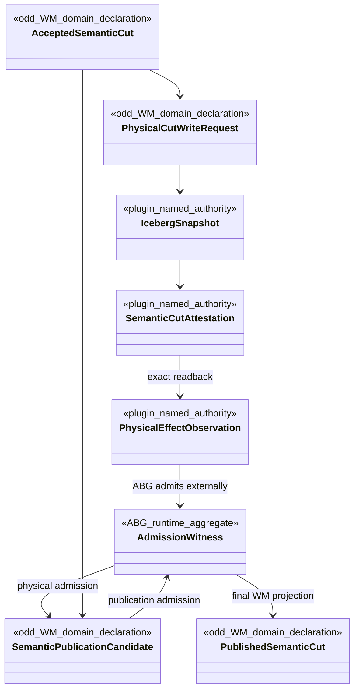
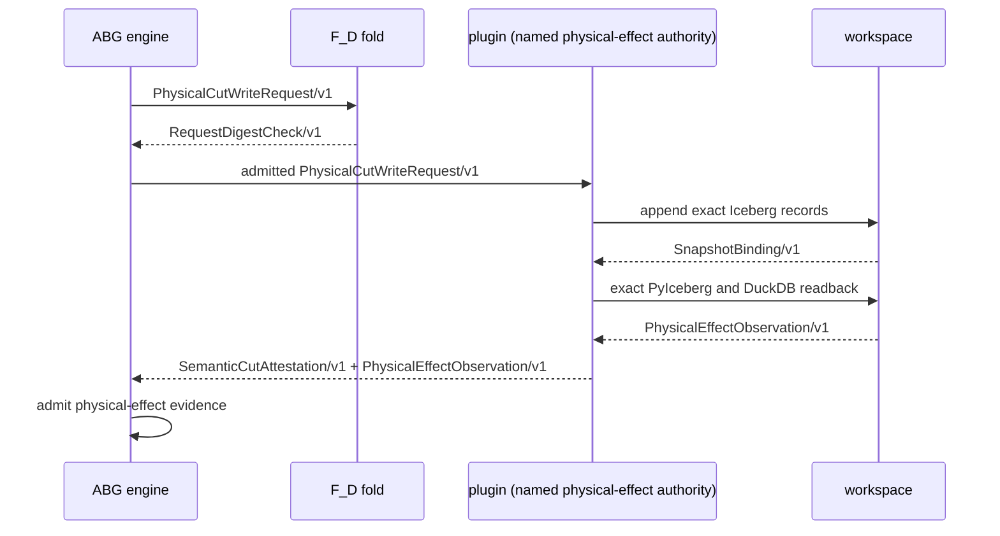
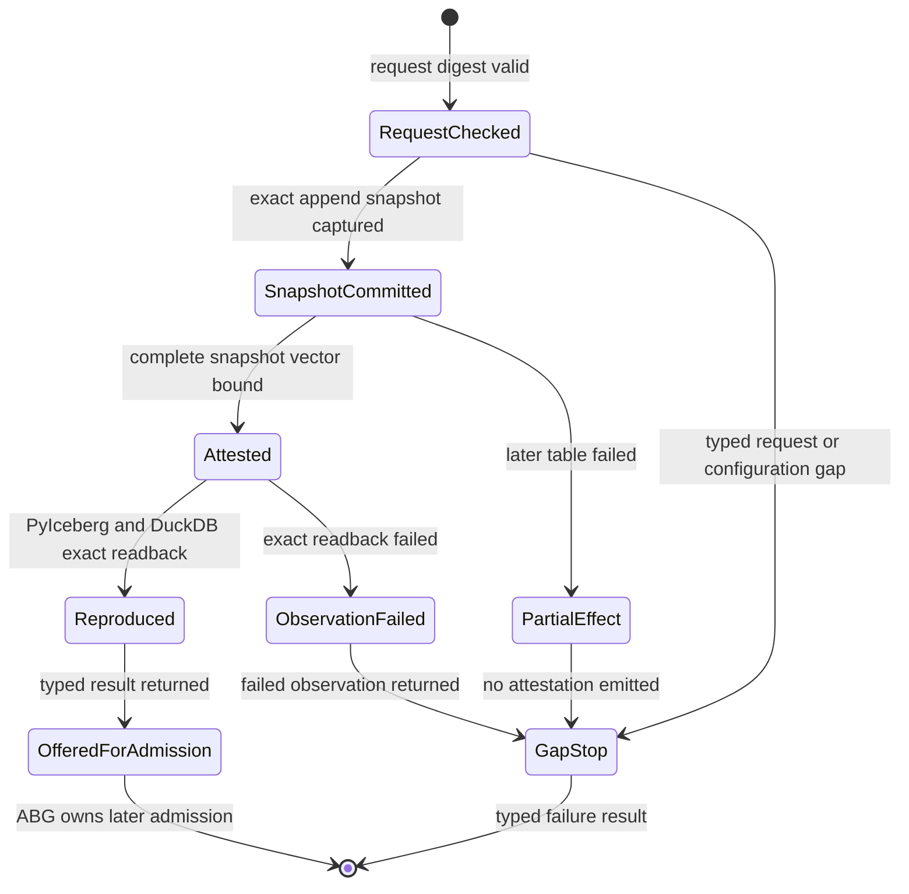

# PyIceberg Storage Effect Implementation Design

**Status**: Implemented; pending full review
**Date**: 2026-07-12
**Ticket**: T-030
**Basis**: ADR-WM-003 and ADR-WM-005

This adapter is one named physical-effect authority. It cannot accept semantic
claims, admit runtime truth, verify itself, or publish a WM cut.

## Domain Model

## Sequence

## State Machine

All adapter states are request-local effect states. Published/admitted states
exist only after ABG replay outside this adapter.

## Module Boundaries

| Module | Responsibility | Forbidden authority |
| --- | --- | --- |
| `canonical.py` | RFC 8785 bytes and SHA-256 digests | semantic interpretation |
| `models.py` | strict versioned protocol models and digest closure | storage IO or admission |
| `config.py` | deployment-owned catalog, warehouse, receipt, and profile config | request-selected paths |
| `physical_envelope.py` | single canonical persisted-envelope digest projection | storage IO or query selection |
| `store.py` | Iceberg schema/table effects, exact snapshot readback, receipts | traversal, semantic acceptance, continuation |
| `duckdb_proof.py` | exact metadata-file and snapshot-ID readback through pinned DuckDB/Iceberg | latest-version guessing or query authority |
| `service.py` | operation dispatch and typed failure projection | retry loop or next-work selection |
| `cli.py` | one-request/one-response JSONL framing | daemon/controller behavior |

`__main__.py` and the package script are projections over `cli.py`; they do not
duplicate protocol behavior.

## Write Protocol

1. Strictly validate the RFC 8785 digest over the received request before
   defaults or normalization are applied.
2. Reject a storage-profile mismatch.
3. Acquire the process-shared lock derived from `write_request_id`; retain it
   through receipt recovery, all table effects, observation, and receipt commit.
4. Resolve or create each namespaced table with the fixed v1 Iceberg schema.
5. Resolve an exact prior request from snapshot identity properties or append
   the physical record envelope.
6. Capture the snapshot and metadata location from the table object mutated by
   that append; a later concurrent commit cannot retarget the binding.
7. Repeat for every table while retaining completed physical refs.
8. Construct one assurance-neutral attestation over the complete snapshot
   vector.
9. Reproduce every named snapshot through PyIceberg and DuckDB, retaining the
   actual results in a separate `PhysicalEffectObservation`.
10. Persist a small atomic effect receipt and return both carriers.

If a later table fails, completed snapshots are returned as unadmitted physical
effects. No attestation is emitted.

## Observation Protocol

Observation loads every named table, proves the fixed schema fingerprint and
attested metadata location, resolves the exact historical snapshot, filters the
request/cut rows, and recomputes the full physical-envelope digest. Current
table state is never substituted for the named snapshot. PyIceberg and DuckDB
must independently reproduce the same row count and canonical payload digest.
DuckDB receives both the attested metadata URI and `snapshot_from_id`; unsafe
metadata-version guessing remains disabled.

The attestation has no assurance field. The observation is constructed only
after both physical readers run and binds their per-snapshot results to the
exact attestation ID and digest. It is provider output, not ABG admission or WM
semantic publication.

## Idempotency

Receipts bind request identity to request digest and attestation. A
request-identity lock serializes concurrent local CLI processes before receipt
lookup, preventing check-then-append races. If a receipt
is missing, the request digest and admission ref embedded in every physical row
and the request identity embedded in snapshot summary properties make exact
commit recovery possible. Unrelated snapshots are not row-scanned. Changed
content or admission envelope fails closed.

## Failure Boundary

Configuration, validation, storage, and unexpected adapter failures produce one
operation-typed response line. Exit status `2` carries that typed failure and is
decoded by the TypeScript adapter. Response decoders validate complete runtime
shape and correlate request identity, digest, verification identity, and
attestation subject back to the exact outbound request. They
shapes before exposing typed results. Post-write observation failure also
returns the failed observation and every completed physical snapshot without
emitting a successful attestation result.

## Proof Classification

The Python suite proves the local effect and protocol. The TypeScript suite
proves cross-language compatibility. Neither proves product runtime invocation
or semantic publication because those remain behind the GTL/ABG review gate.
