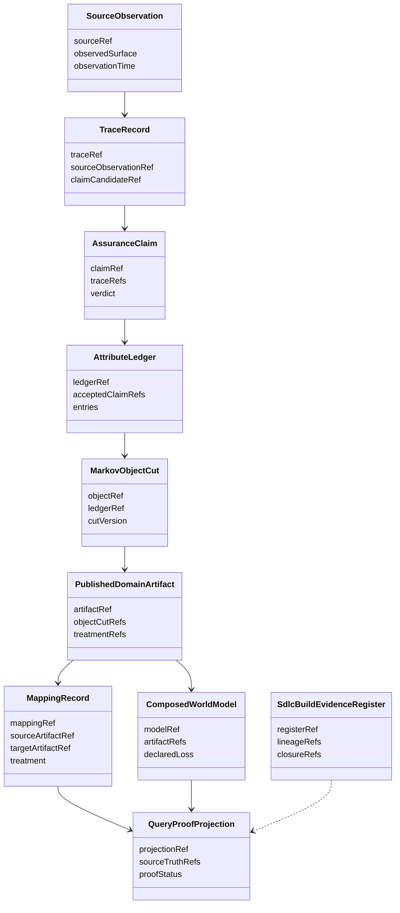

# TypeScript Module Boundaries

**Status**: Active target design
**Date**: 2026-05-15
**Method**: `DESIGN_MODULE_METHOD.md`
**Derived from**:
- `build_tenants/python/design/40-generated-implementation-design.md`
- `build_tenants/python/design/40-generated-implementation-modules.md`
- `build_tenants/typescript/design/30-world-model-odd-design.md`

This surface is the target module boundary asset required for a
reference-derived TypeScript realization.

It is not a source-file manifest. It defines the realization cuts that keep
semantic authority, deterministic transforms, effect shells, and projections
separate.

## Irreducible Architectural Carrier Set

The TypeScript tenant's irreducible carrier set is:

| Carrier | Authority Role |
|---|---|
| `SourceObservation` | admitted observation of a source surface, record, interface, code path, document, or event |
| `TraceRecord` | recoverable evidence that links a source observation to a semantic claim candidate |
| `AssuranceClaim` | reviewed claim that may be admitted into the semantic substrate |
| `AttributeLedger` | append-only semantic source for accepted attributes |
| `MarkovObjectCut` | immutable published object cut projected from the attribute ledger |
| `PublishedDomainArtifact` | versioned local semantic publication unit |
| `ComposedWorldModel` | reference-preserving higher-order composition over published artifacts |
| `MappingRecord` | durable correspondence/treatment record over published domains |
| `QueryProofProjection` | downstream read/proof projection over admitted semantic truth and constructive history |
| `SdlcBuildEvidenceRegister` | downstream build-governance evidence imported from installed `odd_sdlc` registers |

All other records are subordinate payloads unless a later design proves that
they need independent authority, versioning, or public pattern-match semantics.

`SdlcBuildEvidenceRegister` is explicitly not part of the world-model semantic
truth chain. It records and projects build governance.

## Structural Carrier Diagram



## Module Boundary Table

| Module Boundary | Design Role | Owns | Must Not Own |
|---|---|---|---|
| `domain/` | carrier module | immutable carrier definitions and admitted asset names | file publication, traversal, or worker dispatch |
| `gtl/` | carrier module | graph functions, jobs, module publication, function catalog | deterministic materialization internals |
| `sdlc/` | binding/adapter module | installed `odd_sdlc` register reads, execution-contract reads, build evidence projection | world-model semantic truth |
| `adapters/` | binding/adapter module | source-shape parsing and source observation admission | durable semantic publication |
| `build_line/` | semantic kernel and materialization module | source-to-trace-to-assurance-to-ledger-to-artifact transforms beneath graph functions | graph traversal ownership |
| `world_model/` | carrier/materialization module | attribute ledger, object cuts, domain artifacts, validation, registry, composition | query serving as truth |
| `mapping/` | semantic kernel and projection module | correspondences and treatments over published domains | source adapter parsing or mutable master data |
| `query/` | projection module | read models over admitted semantic truth and constructive history | accepted semantic truth |
| `proof/` | projection/evaluator module | reverse recoverability, conventional proof, covariant proof, closure reports | source mutation or graph traversal |
| `release/` | effect shell module | release/install boundary and installed builder-product proof | source-project product definition |
| `cli/` | effect shell module | operator command binding to published graph functions and projections | runtime traversal loops |

## Boundary Rules

### 1. Authority Seam Closure

Each semantic state has one authoritative carrier:

- source meaning enters through `SourceObservation`
- evidence is carried by `TraceRecord`
- claim admission is carried by `AssuranceClaim`
- accepted attributes are carried by `AttributeLedger`
- object identity is published through `MarkovObjectCut`
- local semantic publication is carried by `PublishedDomainArtifact`
- higher-order composition is carried by `ComposedWorldModel`
- mapping correspondence is carried by `MappingRecord`
- query and proof are downstream `QueryProofProjection`

No module may reconstruct a missing upstream carrier from raw files and still
claim closure.

### 2. Essential Carrier Consolidation

The target TypeScript design should avoid one peer type per Python helper.
Python module names are reference evidence only.

Subordinate payloads remain local unless they cross a public GTL, artifact,
query, proof, release, or installed-product boundary.

### 3. Enforcement After Proof

Schema validation, TypeScript types, decoders, and test fixtures lock in an
admitted carrier shape. They do not replace admission.

Foreign input collapses at ingress into `SourceObservation` or into an explicit
external adapter payload that immediately constructs `SourceObservation`.

### 4. ODD Alignment

If a module appears to decide:

- what graph function is running
- what target is next
- whether traversal is closed
- whether a probabilistic worker should continue

then that boundary is not a deterministic module boundary. It must be repriced
against `ODD_METHOD.md` and ABG ownership before implementation proceeds.

## Reference Mapping From Python Modules

| Python Reference Group | TypeScript Target Boundary | Mapping |
|---|---|---|
| M-CARRIER | `domain/`, `gtl/`, `cli/` | preserve carrier intent; replace Python app loop with ABG-backed graph function binding |
| M-CONSTRUCTOR | `build_line/`, `proof/`, `gtl/` | preserve deterministic materializer role; keep traversal in GTL/ABG |
| M-ADAPTER | `adapters/` | preserve bounded source ingestion; generalize beyond FpML |
| M-BUILD-LINE | `build_line/`, `world_model/`, `mapping/` | preserve semantic chain; generalize trade/APRA into published-domain mapping |
| M-WORLD | `world_model/` | preserve ledger, object-cut, artifact, registry, validation roles |
| M-QUERY | `query/` | preserve downstream projection role; avoid making filesystem layout semantic truth |
| M-PROOF | `proof/` | preserve conventional and covariant proof roles |
| M-RELEASE | `release/`, `sdlc/` | preserve installed-product proof; use current `odd_sdlc` governance evidence |

## Downstream Implementation Shape

The first implementation wave should remain close to ADR-001's target layout
while adding the module boundaries ratified here:

```text
build_tenants/typescript/code/src/
├── adapters/
├── build_line/
├── cli/
├── domain/
├── gtl/
├── mapping/
├── proof/
├── query/
├── release/
├── sdlc/
└── world_model/
```

Implementation and unit tests must be traceable to these module boundaries.
