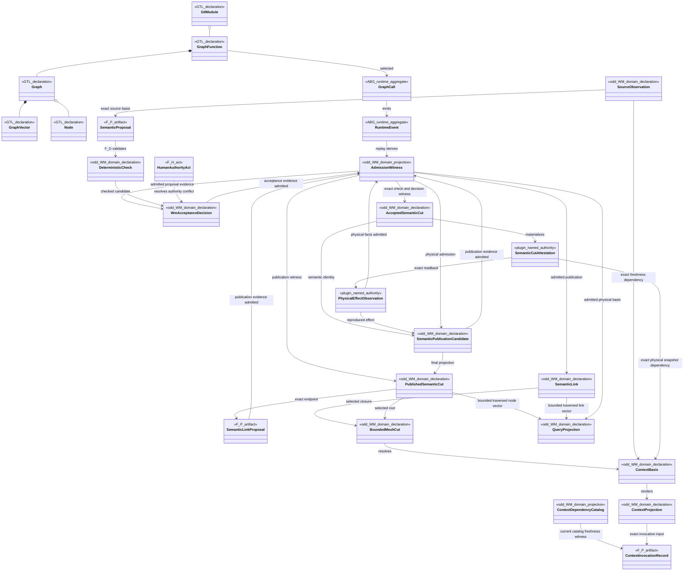
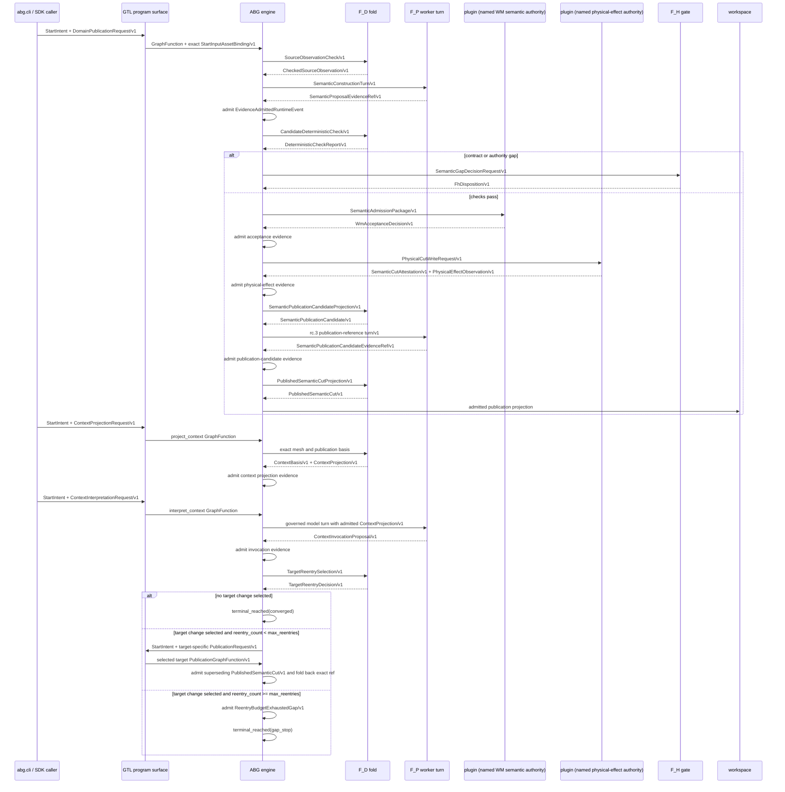

# Admitted Semantic Steel-Thread Design

**Status**: Target migration design; implementation contracts authorized, native
payload realization and final product ratification pending review
**Date**: 2026-07-12
**Tickets**: T-023, T-026, T-028, T-029, T-030
**Re-entry**: Design reframe
**Proving substrate**: ABIogenesis `4.6.0-rc.3`, odd_glc `0.1.0`

## Decision

The target product slice has one constructive path. A selected public
GraphFunction carries an exact source/candidate binding through ABG. ABG events
witness runtime admission; deterministic WM checks establish contract validity;
an attributed WM authority decides semantic acceptance; physical storage emits
an assurance-neutral attestation and observation; ABG admits those effects; and
only then does WM derive a published semantic cut. Mesh, context, and query
consume that published cut.

The current rc.3 build does not yet execute the WM deterministic kernel or
semantic constructor inside those selected GraphFunctions. It implements the
domain contracts in a local reference kernel and proves exact-reference
transport, traversal, and admission through rc.3 separately. The as-built
boundary and failed axiom checks are recorded in
`95-rc3-reference-bridge-as-built-review.md`. This target design must not be
read as proof that the migration is complete.

The rc.3 target carrier cannot embed the complete WM payload. The proving
adapter therefore binds an immutable candidate by exact ref and digest through
`StartInputAssetBinding` and the F_P result evidence refs. This is a declared
reference-and-digest bridge, not a claim of inline payload transport.

## Domain Model

Ownership rules:

- GTL declarations are immutable data. They do not perform traversal.
- ABG runtime aggregates and replay projections own runtime fact and closure.
- F_P artifacts are proposals. They cannot publish semantic truth.
- WM deterministic checks validate shape and identity but do not create ABG
  admission.
- WM semantic authority decides domain acceptance and is always attributed.
- Storage attestation and observation describe physical effects only.

## Sequence

No plugin renders prompts, traverses graph work, or authors ABG closure. The
rc.3 F_P adapter returns transform evidence; the ABG assurance fold owns vector
closure. Every artifact crosses ABG admission before a later stage consumes it.

## State Machine

```mermaid
stateDiagram-v2
  [*] --> SourceObserved: payload_observed and payload_validated
  SourceObserved --> ProposalReturned: actor_result_artifact_observed
  ProposalReturned --> ProposalAdmitted: evidence_admitted(candidate_ref)
  ProposalAdmitted --> CandidateChecked: evidence_admitted(check_report_ref)
  ProposalAdmitted --> GapStop: payload_rejected
  CandidateChecked --> AwaitingHumanGate: authority_conflict
  CandidateChecked --> SemanticallyAccepted: evidence_admitted(acceptance_ref)
  AwaitingHumanGate --> SemanticallyAccepted: F_H accept act admitted
  AwaitingHumanGate --> GapStop: F_H reject or hold act admitted
  SemanticallyAccepted --> PhysicallyAttested: evidence_admitted(attestation_ref)
  PhysicallyAttested --> EffectReproduced: evidence_admitted(observation_ref)
  PhysicallyAttested --> GapStop: physical observation failed
  EffectReproduced --> PublicationCandidate: F_D projection from admitted prerequisites
  PublicationCandidate --> PublicationCandidateAdmitted: evidence_admitted(publication_candidate_ref)
  PublicationCandidateAdmitted --> Published: PublishedSemanticCut projection
  Published --> PublicationConverged: no downstream context work selected
  Published --> ContextResolved: evidence_admitted(context_basis_ref)
  ContextResolved --> InvocationAdmitted: evidence_admitted(invocation_ref)
  ContextResolved --> StaleGap: dependency digest changed
  InvocationAdmitted --> InvocationConverged: no target change selected
  InvocationAdmitted --> ReentryPending: target change and reentry_count < max_reentries
  InvocationAdmitted --> ReentryBudgetExhausted: target change and reentry_count >= max_reentries
  ReentryPending --> Published: target GraphFunction converged; fold back exact publication ref
  Published --> Superseded: evidence_admitted(superseding_cut_ref)
  PublicationConverged --> [*]: terminal_reached(converged)
  InvocationConverged --> [*]: terminal_reached(converged)
  ReentryBudgetExhausted --> [*]: terminal_reached(gap_stop)
  GapStop --> [*]: terminal_reached(gap_stop)
  StaleGap --> [*]: terminal_reached(gap_stop)
  Superseded --> [*]: terminal_reached(converged)
```

Each state is reconstructed from admitted events and exact evidence refs. There
is no mutable product-side status ledger. Recursion from an invocation proposal
to semantic publication is a new declared GraphFunction invocation with an
ABG-owned `max_reentries` guard and exact publication-ref foldback, not a local
retry. Budget exhaustion is a typed gap terminal; WM adds no hidden round loop.

## Stable And Provisional Contracts

### Retained Mesh Supersession Witness

The retained FpML slice now materializes two immutable mesh cuts rather than
editing the first cut in place. The second cut:

- replaces the interpreted trade publication through an admitted
  `supersedes` link;
- closes the validity intervals of replaced semantic links and requires every
  superseded link to resolve through a finite chain to an active successor;
- retains one exact published `common_model` node adopted by both local
  domains;
- preserves the unchanged common-model and common-to-source exact refs;
- limits source-change pressure to the source and its interpreted dependent;
  and
- carries the unresolved business-unit reconciliation as a typed gap.

The hash-bound witness is persisted under `mesh_supersession` in
`test_env/proof/20260712T000000Z_full-build-v1/reference-semantic-slice.json`.
This closes the T-023 retained-mesh acceptance surface. It does not change the
native GraphFunction migration or release exclusions owned by T-026.

Stable WM contracts across a successor GTL/ABG line:

- exact source, candidate, check, acceptance, attestation, observation, and
  publication refs and digests;
- F_P proposal versus F_D validation versus WM semantic acceptance;
- ABG event admission before downstream consumption;
- immutable published-cut identity and exact snapshot vector;
- typed gaps, declared fidelity/loss, and exact context basis; and
- no product-local traversal or rival status ledger.

Provisional rc.3 mechanics:

- `StartInputAssetBinding` URI/ref encoding;
- candidate transport through F_P `evidence_refs` rather than an inline target
  payload;
- the final publication candidate is re-carried through the composed rc.3
  publication function because rc.3 exposes no direct private-refinement start;
- canonical event field names used by the replay adapter; and
- graph-call/run/work identity formatting.

A successor adapter passes migration only when the same fixture proves:

1. source and candidate payload digests are byte-equivalent;
2. proposal, check, admission, acceptance, physical effect, and publication
   identities are trace-equivalent;
3. replay derives the same lawful state transitions and typed gaps;
4. closure remains ABG/F_H-owned; and
5. no WM semantic contract changes unless a design reframe is explicitly
   admitted.

## Diagram Gate Evaluation

This table evaluates the target design. It does not override the as-built
evaluation in `95-rc3-reference-bridge-as-built-review.md`.

| Check | Result | Evidence |
| --- | --- | --- |
| D1 | Pass | Every entity has a GTL, ABG, WM, F_P, F_H, or named-effect owner. |
| D2 | Pass | `GraphFunction` decomposes into `Graph`, `GraphVector`, and `Node`. |
| D3 | N/A | The design adds no ABG engine entity. |
| D4 | Pass | Admission and published truth derive from admitted runtime events. |
| D5 | Pass | Graph, policy, bindings, and contracts are declaration data. |
| S1 | Pass | ABG owns the governed F_P turn; no product prompt shell exists. |
| S2 | Pass | All work is GraphFunction traversal; no plugin fan-out loop exists. |
| S3 | Pass | Probabilistic execution occurs only on the F_P worker lifeline. |
| S4 | Pass | Closure stays with ABG or explicit F_H; plugins return evidence. |
| S5 | Pass | Every F_P or physical artifact is admitted before consumption. |
| S6 | Pass | Every arrow names a versioned carrier or canonical runtime event. |
| M1 | Pass | Every state names its replay witness. |
| M2 | Pass | Transitions are authorized by F_D, ABG admission, WM authority, or F_H. |
| M3 | Pass | Semantic re-entry is a declared target GraphFunction invocation with exact publication-ref foldback. |
| M4 | Pass | Publication-only, no-change invocation, supersession, stale, ordinary gap, and budget-exhaustion paths all reach typed `converged` or `gap_stop` terminals. |
| M5 | Pass | Authority conflict has an explicit F_H state. |
| M6 | Pass | Re-entry requires `reentry_count < max_reentries`; exhaustion enters `ReentryBudgetExhausted` and terminates `gap_stop`. |
| X1 | Pass | Sequence lifelines use the same owners as the domain entities. |
| X2 | Pass | Sequence and state surfaces both carry target selection, guarded re-entry, exact-ref foldback, no-change convergence, and budget exhaustion. |
| X3 | Pass | Carrier and terminal vocabularies are existing or defined by this design. |
| X4 | Pass | Inline rc.3 payload transport remains a named migration gap. |

## Implementation Order

1. Publish resolvable schemas for the state aggregate and all seven public
   GraphFunction request/outcome carriers.
2. Generalize public start to exact input bindings and candidate evidence refs;
   retain the handle-only form only as a transport smoke test.
3. Derive admission witnesses from canonical runtime events.
4. Require deterministic checks and attributed WM acceptance before creating
   an accepted semantic cut.
5. Require admitted physical evidence before creating a published semantic cut.
6. Admit the complete publication candidate before deriving the final published
   cut.
7. Resolve mesh/context/query only from published cuts and admitted effects.
8. Remove the filesystem runner from package exports, executable entry points,
   current tests, and requirement proof.
9. Prove failures for omitted admission, digest mismatch, stale closure,
   unresolvable schema, physical mismatch, and attempted rival publication.
