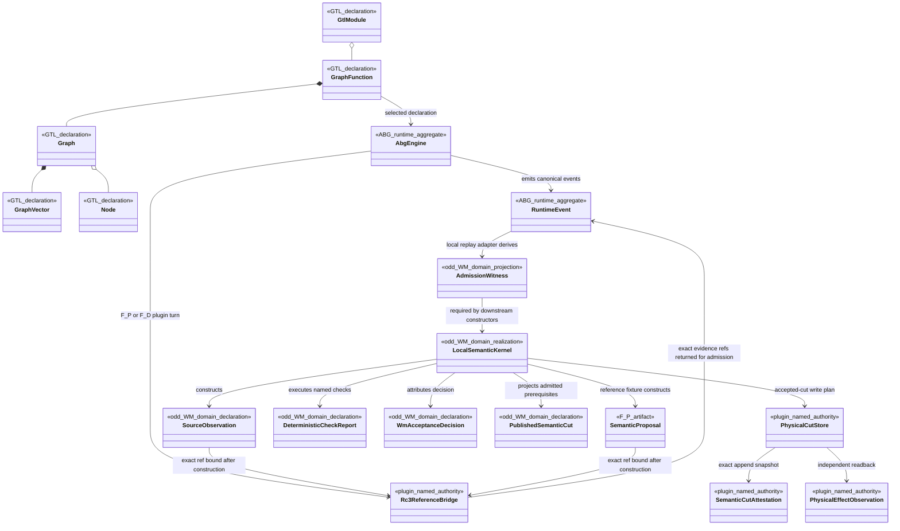
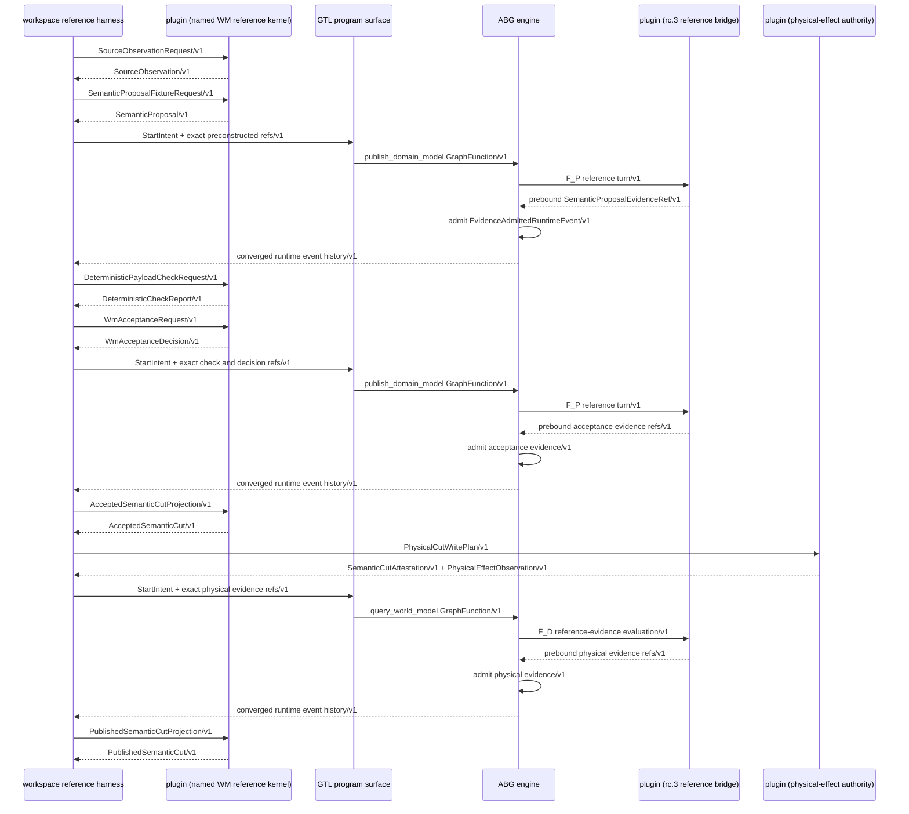
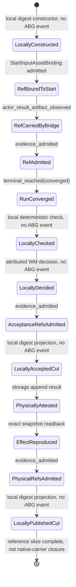

# RC3 Reference-Bridge As-Built Review

**Status**: Current as-built backfill; fails native-carrier ratification
**Date**: 2026-07-12
**Tickets**: T-026, T-029, T-030
**Re-entry**: Design reframe
**Target design**: `90-admitted-semantic-steel-thread-design.md`

## Finding

The current build has two separate pieces that are not yet one constructive
carrier:

1. a local deterministic WM kernel creates and checks exact semantic objects;
2. selected rc.3 GraphFunctions traverse declared graphs and admit exact refs
   through a reference-and-digest bridge.

The local kernel output is bound into the rc.3 run after it has been created.
The selected GraphFunction does not execute that kernel and the F_P bridge does
not author the semantic proposal. The build therefore proves the contracts,
exact-ref transport, ABG event shape, admission projection, physical storage,
mesh, context, and query behavior. It does not prove native GTL constructive
execution or calibrated F_P semantic authorship.

The candidate Markov-object v1 carrier also remains explicitly inconclusive on
held-out treatment verification. The local constructor cannot mint `passed`;
that status requires a future separately admitted verification contract.

## As-Built Domain Model

The missing edge is deliberate and load-bearing: `GraphFunction` has no
execution edge to `LocalSemanticKernel`. Adding a decorative edge would conceal
the migration gap.

## As-Built Sequence

The sequence is typed and does not fabricate an inline payload carrier. It also
makes the defect visible: semantic construction and deterministic projection
are workspace-orchestrated reference-kernel calls, not selected GraphFunction
payload execution.

## As-Built State Machine

States explicitly labelled `local` are digest-addressed domain projections but
are not replay-native ABG states. They cannot be presented as ABG closure or as
proof that the selected GraphFunction performed the semantic transition.

## Axiom Evaluation

| Check | Result | Evidence or defect |
| --- | --- | --- |
| D1 | Pass | Every entity names GTL, ABG, WM, F_P, workspace, or named plugin ownership. |
| D2 | **Fail** | Graph children exist, but their bindings do not execute the WM semantic kernel; the carrier is behaviorally a reference bridge. |
| D3 | N/A | No new ABG engine entity is introduced. |
| D4 | **Fail** | Admission witnesses are replay-derived, but accepted and published semantic states are local projections over witnesses rather than replay-native projections. |
| D5 | Pass | Graphs, contracts, policies, and bindings remain declaration data. |
| S1 | Pass | No product plugin assembles a prompt. |
| S2 | **Fail** | The reference harness orders semantic stages outside GraphFunction traversal. |
| S3 | **Fail** | The semantic proposal exists before the F_P reference turn; calibrated F_P authorship is not proven. |
| S4 | Pass | The bridge does not author ABG closure; terminal truth remains ABG-owned. |
| S5 | Pass | A candidate ref is admitted before acceptance, and physical refs are admitted before publication. |
| S6 | Pass | Every message names a versioned carrier or canonical runtime event. |
| M1 | **Fail** | Local semantic states have no direct witnessing ABG transition event. |
| M2 | **Fail** | Initial construction and accepted/published-cut transitions name local digest code rather than an admitted evaluator, rule, policy, or authority act. |
| M3 | Pass | The slice has no hidden local retry or recursion loop. |
| M4 | **Fail** | `reference slice complete` is not a product terminal and cannot stand in for native constructive convergence. |
| M5 | N/A | This fixture contains no authority conflict or human-gate transition. |
| M6 | N/A | The reference slice performs no iterative round work. |
| X1 | Pass | Entity owners are consistent across the as-built diagrams. |
| X2 | **Fail** | Local check, decision, acceptance, and publication transitions do not correspond to native ABG traversal arrows. |
| X3 | Pass | All shown carriers and event kinds are declared. |
| X4 | Pass | The missing native payload carrier is recorded below rather than hidden in a plugin claim. |

## Typed Migration Gaps

| Gap | Required closure |
| --- | --- |
| `native_graph_payload_execution_not_realized` | A selected published GraphFunction executes the WM transform/evaluator contracts over inline or otherwise native typed payloads. |
| `calibrated_fp_authorship_not_proven` | The semantic proposal is authored during the governed F_P turn, not constructed first and echoed as an evidence ref. |
| `semantic_state_projection_not_replay_native` | Accepted/publication projections are derived from admitted event payloads or a successor ABG projection contract, without a workspace orchestration ledger. |
| `glc_downstream_carrier_not_available` | The selected GLC product exposes the downstream-program specialization carrier required by the floating product contract. |

## Disposition

Retain the current implementation as an executable reference kernel and exact
storage/contract test bed. Do not call it native GTL realization, full semantic
admission-chain proof, or product ratification. Migration preserves exact
payload digests, authority splits, physical snapshot identity, typed gaps, and
context basis behavior; it replaces the rc.3 reference bridge and workspace
stage ordering.
