# AI SDLC Manifesto 02

Source images: `Slide1.png` through `Slide26.png`.

This document captures the slide deck as text and Mermaid diagrams. Some small
labels were reconstructed from the rendered slide images and OCR, so wording is
best-effort where the source text was low resolution.

## Slide 1 - AI SDLC Method

Theme:

- Bootstrapping intent
- The consciousness loop
- The future is organic

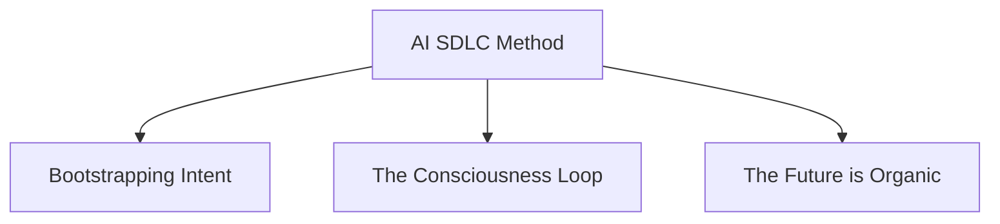

## Slide 2 - Where Does Intent Come From?

The slide frames intent as a human bootstrap mechanism. Reality is too complex
to store directly. Humans observe reality, form a mental abstraction, evaluate
the difference between observation and their mental model, and generate intent.
That intent drives the construction of IT systems and world models.

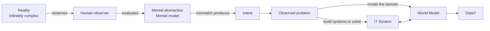

## Slide 3 - Differences Between Humans, LLMs And Agents

For system design, the slide maps human cognitive surfaces to LLM surfaces, and
then positions agents as proxies for human intent.

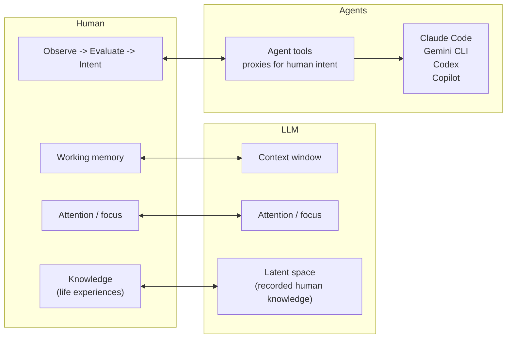

## Slide 4 - Human Tools For LLMs

Humans have limited individual capacity, but use hierarchies and networks to
manage complexity beyond one person. The slide argues that if agents are
functionally equivalent at some tasks, parts of those hierarchies can be
automated.

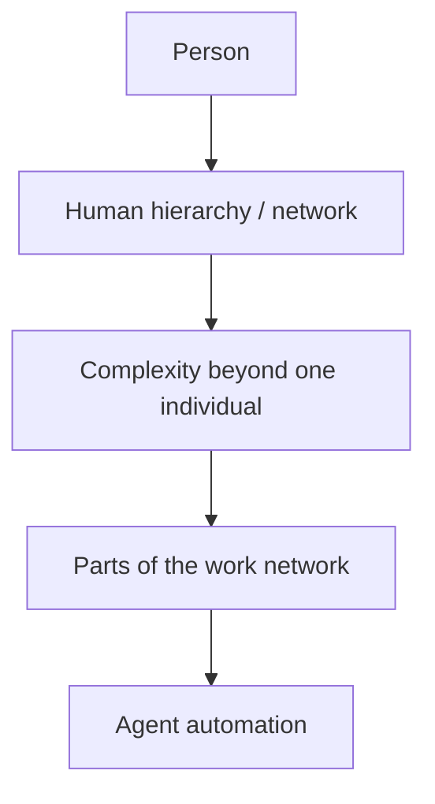

## Slide 5 - The Future Is Constant Transformation

Spec Driven Development at the business and organization level is presented as
the mechanism for continuous reconfiguration and evolution.

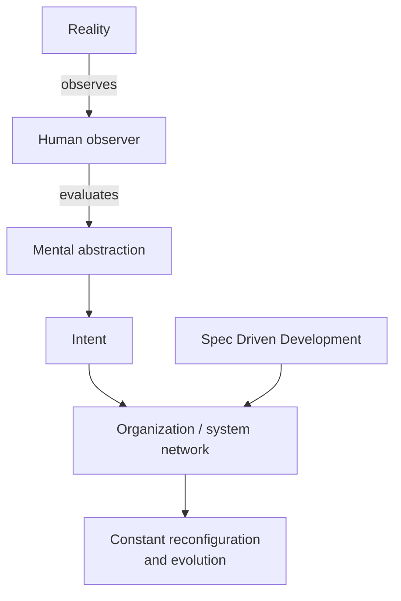

## Slide 6 - AI Organisation Roadmap

The roadmap is outcome driven. The organization evolves in service of an
outcome: an agile, constantly reconfiguring environment and eventually an
AI-organic organization.

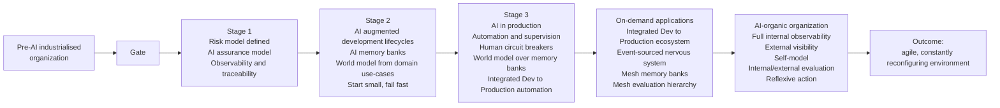

## Slide 7 - Spec Driven Development And Context Engineering

LLM context is treated as equivalent to active human memory. The methodology
manages what is in active memory so the model has enough qualified context
without losing attention in excess detail.

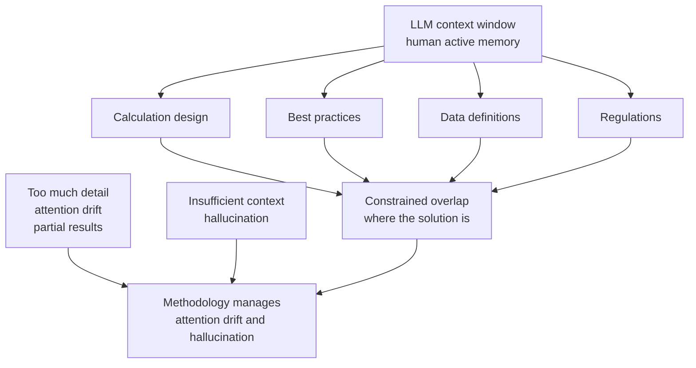

## Slide 8 - AI Augmented Asset Building

AI augmented asset building is defined as a human-in-the-middle process for
managing project context.

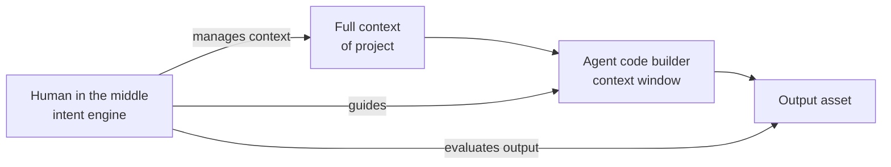

## Slide 9 - Building Systems From Intent

The AI augmented SDLC places humans above the lifecycle as observers,
evaluators, intent providers, and outcome guides. Feedback and telemetry run
across the full loop.

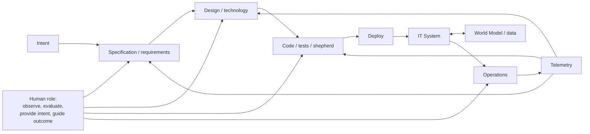

## Slide 10 - Builder / Executor

The builder-executor pattern separates asset construction from asset execution
and the creation of domain data. Each process can be annotated with
verification, security, gates and controls, and versioning.

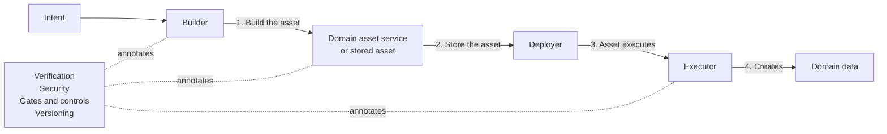

## Slide 11 - Observer / Evaluator

The observer-evaluator pattern separates the changing world, observation, and
evaluation against a required-world model. The evaluator creates intent and
requirements pressure.

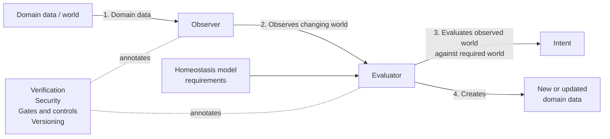

## Slide 12 - Discovery

The slide contains only the title `Discovery`.

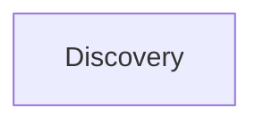

## Slide 13 - Meaning

The slide contains only the title `Meaning`.

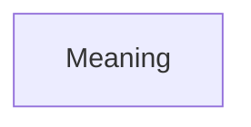

## Slide 14 - Creativity / Synthesis

The slide contains only the title `Creativity / Synthesis`.

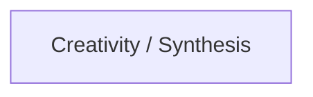

## Slide 15 - Intent Categories

Intent is divided into discovery and builder intent.

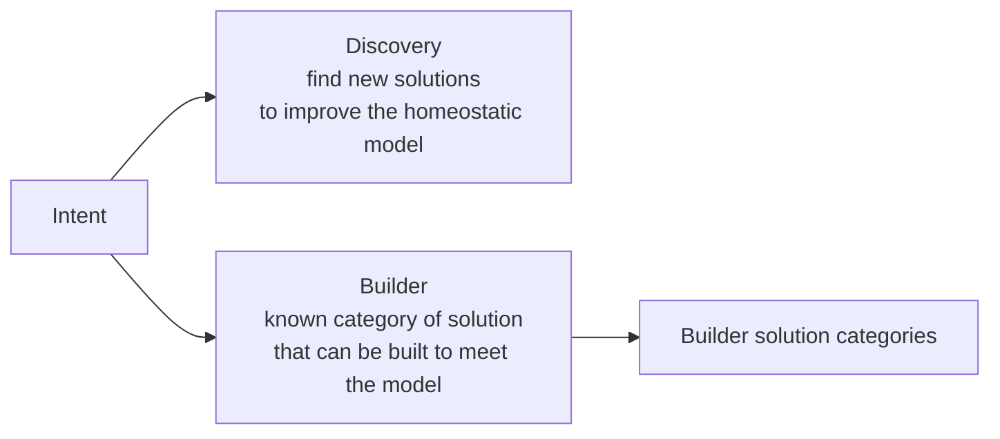

## Slide 16 - Building Systems From Intent: Traditional SDLC

The traditional SDLC is shown as a linear flow with feedback from the deployed IT
system back into earlier lifecycle stages.

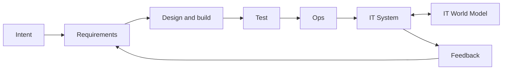

## Slide 17 - Personas And Context For Each Stage Of AI SDLC

Each stage has a persona and context boundary. The technical build stages sit
inside a shared context region.

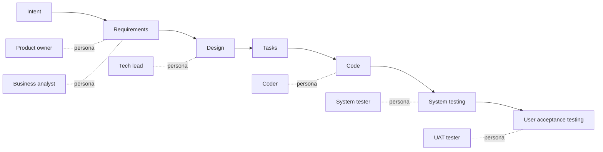

## Slide 18 - AI Augmented Asset Building: Unit Of AI Builder

The unit of AI building is a loop of full context, intent manager, agent LLM,
and output. The intent manager decides intent, manages context, and evaluates
output.

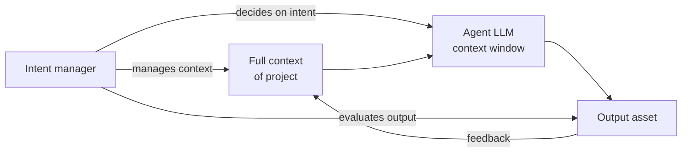

## Slide 19 - Use Case 1: Data Calc Platform - DCP

The DCP example applies the builder-executor pattern to data calculation assets.

```mermaid
flowchart LR
  subgraph Builder["Builder"]
    Dataiku["Dataiku"]
    MarsDnD["Mars drag n drop"]
    AISDLC["AI SDLC"]
  end

  subgraph Assets["Assets"]
    Modules["Modules"]
    Rules["Rules tables"]
    Pipelines["Pipelines"]
  end

  Deployer["Deployer"]

  subgraph Executor["Executor"]
    MARSSandbox["MARS sandbox"]
    EDPCluster["EDPCluster"]
  end

  subgraph Domain["Domain data"]
    CDH["EDP.CDH"]
  end

  Builder -->|1. Build the asset| Assets
  Assets -->|2. Store the asset| Deployer
  Deployer -->|3. Asset executes| Executor
  Executor -->|4. Creates domain data| Domain
```

## Slide 20 - Use Case 1: DCP, Tooling View

This version maps builder tools, Git/code storage, cloud execution, and cloud
domain data.

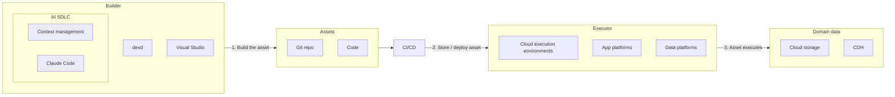

## Slide 21 - Secure Software Development Life Cycle

The slide marks `Building Block 1`.

```mermaid
flowchart TB
  SSDLC["Secure Software Development Life Cycle"]
  BB1["Building Block 1"]
  SSDLC --> BB1
```

## Slide 22 - Building Systems From Intent Augmented With AI

The augmented SDLC splits lifecycle stages and attaches persona/context lanes
to each stage.

```mermaid
flowchart LR
  Intent["Intent"]
  Req["Requirements"]
  Design["Design"]
  Tasks["Tasks"]
  Build["Build"]
  UIT["Unit and integration test"]
  UAT["User acceptance test"]
  Ops["Ops"]

  Intent --> Req --> Design --> Tasks --> Build --> UIT --> UAT --> Ops

  PO["Product owner"] -. context .- Req
  BA["Business analyst"] -. context .- Req
  TL["Tech lead"] -. context .- Design
  Coder["Coder"] -. context .- Build
  Tester1["Tester"] -. context .- UIT
  Tester2["Tester"] -. context .- UAT
  SRE["SRE"] -. context .- Ops
```

## Slide 23 - Intent, IT Systems, And Data

This slide restates the origin of intent and adds the key data claim:

- The IT system is an abstraction of the real world.
- It is a collection of business processes.
- Data is the saved business-process representation.
- Without the original system context, data is meaningless.

The example is a trading system: software engineers work with traders to build
a trading system; traders use it to enact and record trades; the recorded trade
data loses meaning if the context and business rules are lost.

```mermaid
flowchart LR
  Real["Real world<br/>infinitely complex"]
  Human["Human observer"]
  Mental["Mental model"]
  Intent["Intent<br/>requirements"]
  IT["IT system<br/>business processes"]
  WM["IT world model"]
  Data["Saved representation<br/>data"]
  Context["Original system context<br/>business rules"]

  Real -->|observes| Human
  Human --> Mental
  Mental -->|mismatch| Intent
  Intent --> IT
  IT <--> WM
  IT --> Data
  Context --> Data
  Data -->|meaning depends on| Context
```

## Slide 24 - Observe / Interpret / Solve Cycle

The cycle is a simple model of how people solve problems individually or as a
group. Each person brings life experience, or a solution set, to the abstracted
problem. The slide connects this to the scientific method and treats the cycle
as iterative at every granularity.

```mermaid
flowchart LR
  Reality["Reality"]
  Observation["Observation and interpretation"]
  Abstract["Abstract problem domain"]
  SolutionSets["Diverse solution sets<br/>life experience"]
  Solution["Solution"]
  Apply["Solution sets collaboratively applied"]
  Test["Tested against the real world"]

  Reality --> Observation --> Abstract --> SolutionSets --> Solution --> Apply --> Test --> Reality
```

## Slide 25 - Business Domain Software Life Cycle

The business domain lifecycle translates reality into an abstract problem
domain, then into graphs, DAGs, applications, and transformations.

```mermaid
flowchart LR
  Reality["Reality"]
  BA["Business analyst<br/>translates domain<br/>into abstract domain"]
  Abstract["Abstract problem domain"]
  Architect["Data architect<br/>creates graphs<br/>representing the domain"]
  DAG["DAG<br/>domain model along<br/>a query path"]
  Developer["Developer<br/>translates abstract domain<br/>into business functions<br/>over the DAG"]
  App["Application"]
  Pipeline["Transformation pipeline"]
  Transform["Developer writes<br/>transformations between DAGs"]

  Reality --> BA --> Abstract
  Abstract --> Architect --> DAG
  Abstract --> Developer --> App
  DAG --> Pipeline
  Developer --> Transform --> Pipeline
```

## Slide 26 - Business Domain Software Life Cycle With Plato

Plato is introduced as the generating center between the abstract domain graph,
destination declarations, schemas, applications, and transformation code.

```mermaid
flowchart LR
  Reality["Reality"]
  BA["Business analyst<br/>abstracts the domain"]
  Abstract["Abstract problem domain"]
  Architect["Data architect<br/>creates graph over domain"]
  DomainGraph["Abstract domain graph"]
  Dev["Developer<br/>declares destination DAG,<br/>functions, and generators"]
  Plato["Plato"]
  Schema["Destination schema"]
  Code["Transformation code"]
  App["Application"]
  Pipeline["Transformation pipeline"]

  Reality --> BA --> Abstract
  Abstract --> Architect --> DomainGraph
  DomainGraph --> Plato
  Dev --> Plato
  Plato --> Schema
  Plato --> Code
  Schema --> App
  Code --> Pipeline
```

## Consolidated Model

Across the deck, the model can be compressed as:

```mermaid
flowchart TB
  Reality["Reality"]
  Observation["Observation"]
  Abstraction["Mental / problem abstraction"]
  Intent["Intent"]
  Context["Managed context"]
  Agent["Agent / LLM / builder"]
  Asset["Built asset"]
  Execution["Executor / runtime"]
  Data["Domain data"]
  WorldModel["World model"]
  Evaluation["Observer / evaluator"]
  Feedback["Telemetry / feedback"]

  Reality --> Observation --> Abstraction --> Intent
  Intent --> Context --> Agent --> Asset --> Execution --> Data
  Data --> WorldModel
  Data --> Evaluation
  WorldModel --> Evaluation
  Evaluation --> Feedback --> Intent
```

